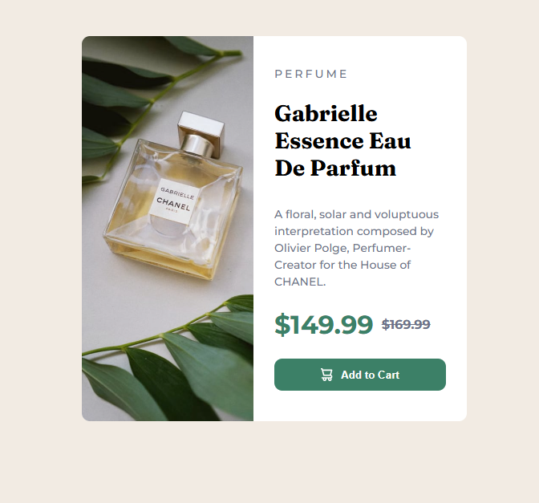

Product Preview Card Component

A responsive Product Preview Card built using HTML5 and CSS3, following a mobile-first and semantic approach.
This project demonstrates responsive images, Flexbox layouts, and clean UI styling.

📸 Preview

## 📸 Screenshot

  

Live Demo:
👉 https://chetan-chaudhari.github.io/Recipe-page/

(Replace this URL if needed)

🚀 Features

Responsive layout for mobile and desktop

Uses <picture> element for device-specific images

Clean Flexbox-based card layout

Semantic HTML (picture, article)

Custom CSS variables for easy theming

Smooth image scaling with object-fit: cover

🛠️ Built With

HTML5

CSS3

Flexbox

Google Fonts

Montserrat (500, 700)

Fraunces (700)

📂 Project Structure
├── index.html
├── style.css
├── screenshot.png
├── images/
│ ├── image-product-desktop.jpg
│ ├── image-product-mobile.jpg
│ ├── icon-cart.svg
│ └── favicon-32x32.png
└── README.md

📱 Responsive Design

Desktop (≥ 769px)

Card layout: side-by-side (image + content)

Desktop product image loaded

Mobile (≤ 475px)

Card layout: stacked (image on top)

Mobile product image loaded

Full-width responsive card

Responsive images are handled using:
<picture>

  <source media="(max-width: 768px)" srcset="./images/image-product-mobile.jpg" />
  <source media="(min-width: 769px)" srcset="./images/image-product-desktop.jpg" />
  
</picture>

🎨 CSS Highlights

CSS variables for colors:
:root {
--green500: hsl(158, 36%, 37%);
--green700: hsl(158, 42%, 18%);
--cream: hsl(30, 38%, 92%);
}
Equal space for image and content using Flexbox:
.card picture,
.card article {
flex: 1;
}
Image scaling:
.product-image {
width: 100%;
height: 100%;
object-fit: cover;
}
📌 What I Learned

How flex: 1 ensures equal space for elements

Proper use of the <picture> element for responsive images

Handling height and width inside Flexbox containers

Mobile-first media query design

Clean separation of layout and content

📄 License

This project is open-source and free to use for learning and personal projects.
